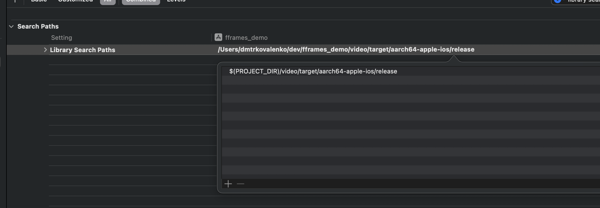
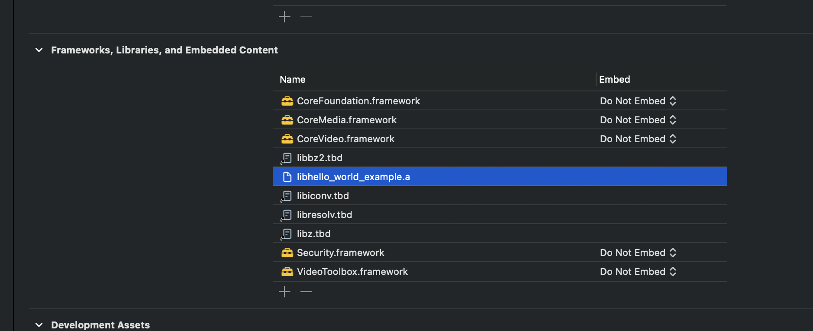

# Build fframes for ios 

This example shows how to cross compile fframes for ios platform and link it with xcode project.

> it is still in beta so access is limited to the beta testers only. Apply for beta test https://fframes.studio/

Clone this repository, install the rust toolchain for cross compiling to IOS and build the rust library for dedicated target.

```bash
rustup target add aarch64-apple-ios
cargo build  --target aarch64-apple-ios --release
```

make sure that this only works on arm64 macs if you need to compile for x86_64 you need to add the target `x86_64-apple-ios` and run the same command with the target `x86_64-apple-ios` or you can create a universal binary using [cargo lipo](https://github.com/TimNN/cargo-lipo).

```bash
rustup target add x86_64-apple-ios aarch64-apple-ios
cargo lipo --release
```

Your target folder now should be have `target/aarch64-apple-ios/release/libhello_world_example.a` file. Which is ready to be linked with your xcode project. Please make sure to add it as a framework and add library search path in your xcode project (it is already added in this example).



add it as a dependency to your xcode project



now your project will be able to run the basic version of fframes example.

